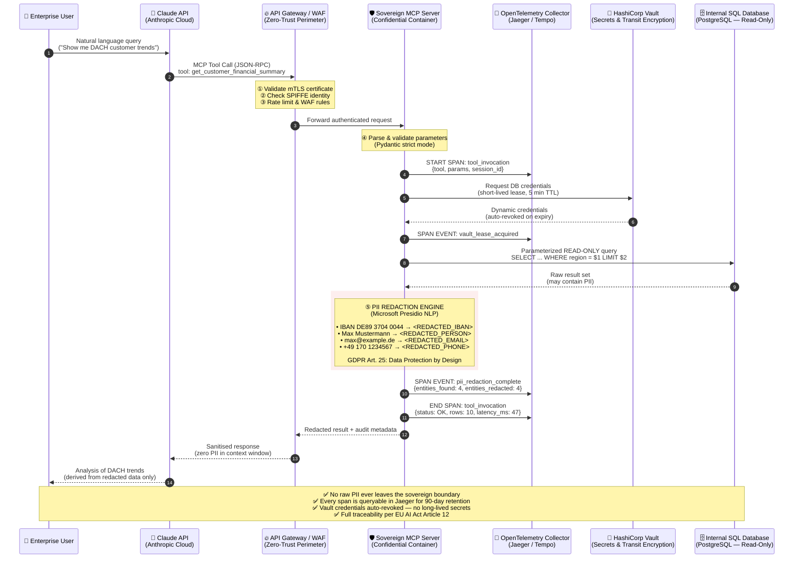

# 🛡️ Sovereign MCP Blueprints

### Production-Grade Model Context Protocol Servers for Hyper-Regulated European Markets

**Banking · Healthcare · Government · Defence**

[](./LICENSE)
[](https://spec.modelcontextprotocol.io)
[](https://www.python.org/)
[](https://www.docker.com/)
[](./docs/gdpr-compliance.md)
[](./docs/eu-ai-act-mapping.md)
[](https://opentelemetry.io/)
[](./compliance-policies/)

---

## The Problem

Every published MCP server tutorial demonstrates how to connect an LLM to an internal system. **None of them demonstrate how to do it without creating an unacceptable compliance liability.**

When a Large Language Model queries your customer database, you face a chain of unsolved obligations:

- **GDPR Article 25** — Data protection by design and by default.
- **GDPR Article 32** — Appropriate technical and organisational security measures.
- **GDPR Article 35** — Data Protection Impact Assessment for high-risk processing.
- **EU AI Act (2024/1689)** — Transparency, traceability, and human oversight for high-risk AI systems.
- **NIS2 Directive** — Cybersecurity risk management for essential and important entities.
- **EBA/DORA** — ICT risk management for financial entities.

Sovereign MCP Blueprints solves this. Every blueprint in this repository is a **production-grade, zero-trust, fully auditable MCP server** that enforces data sovereignty at the protocol layer — not through prompt engineering, not through policies, but through **code that makes non-compliance structurally impossible**.

---

## Core Architecture Principles

| Principle | Implementation | Regulatory Basis |
|---|---|---|
| 🔐 **Zero-Trust Identity** | mTLS, SPIFFE/SPIRE identity, no implicit trust | NIS2 Art. 21, DORA Art. 9 |
| 🧹 **PII Redaction at Source** | Microsoft Presidio NLP engine strips all PII before context return | GDPR Art. 25, EU AI Act Art. 10 |
| 🔑 **Secrets in Hardware** | HashiCorp Vault with transit encryption, no env-var secrets | GDPR Art. 32, EBA Guidelines |
| 📡 **Distributed Tracing** | OpenTelemetry spans on every tool call, exported to Jaeger/Tempo | EU AI Act Art. 12 (Traceability) |
| 🏗️ **Confidential Computing** | Architecture-ready for AMD SEV-SNP / Intel TDX enclaves | GDPR Art. 32(1)(a) — Encryption |
| 📋 **Immutable Audit Trail** | JSONL audit log with cryptographic event chaining | GDPR Art. 5(2), ISO 27001 A.12.4 |
| 🇪🇺 **Data Sovereignty** | Air-gap capable, no external API calls, all data stays on-premise | GDPR Art. 44–49, Schrems II |

---

## Architecture: Zero-Trust Data Flow

The following diagram illustrates the complete security boundary enforced by every Sovereign MCP Blueprint. Claude (via the Anthropic API) **never** receives raw PII. All data traverses five enforcement layers before reaching the LLM context window.



---

## Available Blueprints

| Blueprint | Status | Description | Compliance Scope |
|---|---|---|---|
| [`confidential-sql-mcp`](./blueprints/confidential-sql-mcp/) | ✅ **Production** | Confidential SQL access with Presidio PII redaction, Vault secrets, OTel tracing | GDPR, EU AI Act, DORA |
| [`auditable-sql-mcp`](./blueprints/auditable-sql-mcp/) | ✅ **Stable** | Lightweight read-only SQL with field-level anonymisation and JSONL audit | GDPR Art. 25/32 |
| [`airgapped-gitlab-mcp`](./blueprints/airgapped-gitlab-mcp/) | 🚧 *Planned* | Air-gapped GitLab CE integration — issues, MRs, pipelines, zero SaaS dependency | NIS2, DORA |
| [`confidential-ehr-mcp`](./blueprints/confidential-ehr-mcp/) | 🚧 *Planned* | HL7 FHIR-compliant healthcare record access with de-identification | GDPR, MDR, EHDS |
| [`secure-files-mcp`](./blueprints/secure-files-mcp/) | 🚧 *Planned* | Allowlisted NFS/S3 access with path traversal protection | GDPR, ISO 27001 |

---

## Quick Start

```bash
# 1. Clone the repository
git clone https://github.com/YOUR-ORG/Sovereign-MCP-Blueprints.git
cd Sovereign-MCP-Blueprints

# 2. Navigate to the flagship blueprint
cd blueprints/confidential-sql-mcp

# 3. Configure environment
cp .env.example .env
# Edit .env — set POSTGRES_PASSWORD and VAULT_TOKEN

# 4. Launch the full stack (MCP + PostgreSQL + Vault + Jaeger)
docker compose up -d

# 5. Verify all services are healthy
docker compose ps
docker compose logs -f mcp-server

# 6. Access Jaeger UI for trace inspection
open http://localhost:16686

# 7. Connect to Claude Desktop or your MCP host
# Point your MCP client to: http://localhost:8000/sse
```

---

## Claude Desktop Integration

To connect your local Claude Desktop app to the running Sovereign MCP container, add the following to your `claude_desktop_config.json`:

**Mac/Linux:** `~/.config/Claude/claude_desktop_config.json`  
**Windows:** `%APPDATA%\Claude\claude_desktop_config.json`

```json
{
  "mcpServers": {
    "sovereign-sql-mcp": {
      "command": "docker",
      "args": [
        "exec",
        "-i",
        "sovereign_mcp_server",
        "python",
        "server.py"
      ]
    }
  }
}
```

*Note: Ensure the docker-compose stack is running (`docker compose up -d`) before launching Claude Desktop. The `exec -i` command securely routes the stdio JSON-RPC protocol directly into the isolated container.*

---
[](https://deepwiki.com/WizardofTryout/Sovereign-MCP-Blueprints)

## Repository Structure

```
Sovereign-MCP-Blueprints/
├── README.md                                    # ← You are here
├── LICENSE                                      # MIT License
├── SECURITY.md                                  # Responsible disclosure policy
│
├── blueprints/                                  # MCP Server Templates
│   ├── confidential-sql-mcp/                    # ✅ Flagship blueprint
│   │   ├── docker-compose.yml                   # Full stack: MCP + PG + Vault + Jaeger
│   │   ├── Dockerfile                           # Multi-stage hardened container
│   │   ├── .env.example                         # Environment template (no secrets)
│   │   ├── requirements.txt                     # Pinned Python dependencies
│   │   ├── src/
│   │   │   ├── server.py                        # MCP server — OTel + Presidio + Vault
│   │   │   ├── pii_redaction.py                 # Presidio-based PII engine
│   │   │   ├── vault_client.py                  # HashiCorp Vault integration
│   │   │   ├── otel_setup.py                    # OpenTelemetry bootstrap
│   │   │   └── models.py                        # Pydantic schemas & tool params
│   │   ├── init-db/
│   │   │   └── 01_seed.sql                      # Demo schema + read-only role
│   │   ├── vault-config/
│   │   │   ├── vault-policy.hcl                 # Least-privilege Vault policy
│   │   │   └── init-vault.sh                    # Auto-configure DB secrets engine
│   │   └── tests/
│   │       ├── test_pii_redaction.py            # PII redaction unit tests
│   │       └── test_tool_handler.py             # Tool invocation integration tests
│   │
│   ├── auditable-sql-mcp/                       # ✅ Lightweight variant
│   │   ├── docker-compose.yml
│   │   ├── Dockerfile
│   │   ├── .env.example
│   │   ├── requirements.txt
│   │   ├── src/
│   │   │   └── server.py
│   │   └── init-db/
│   │       └── 01_seed.sql
│   │
│   ├── airgapped-gitlab-mcp/                    # 🚧 Planned
│   │   └── README.md
│   ├── confidential-ehr-mcp/                    # 🚧 Planned
│   │   └── README.md
│   └── secure-files-mcp/                        # 🚧 Planned
│       └── README.md
│
├── k8s-helm-charts/                             # Enterprise Kubernetes Deployment
│   ├── Chart.yaml                               # Helm chart metadata
│   ├── values.yaml                              # Default values (override per env)
│   ├── values-production.yaml                   # Production overrides
│   ├── templates/
│   │   ├── deployment.yaml                      # MCP server Deployment
│   │   ├── service.yaml                         # ClusterIP Service
│   │   ├── ingress.yaml                         # Ingress with TLS termination
│   │   ├── configmap.yaml                       # Non-secret configuration
│   │   ├── networkpolicy.yaml                   # Zero-trust pod networking
│   │   ├── poddisruptionbudget.yaml             # HA guarantees
│   │   ├── serviceaccount.yaml                  # Workload identity
│   │   └── hpa.yaml                             # Horizontal Pod Autoscaler
│   └── README.md                                # Helm deployment guide
│
├── compliance-policies/                         # OPA / Rego Policy Library
│   ├── README.md                                # Policy documentation
│   ├── rego/
│   │   ├── pii_egress_deny.rego                 # Block PII in MCP responses
│   │   ├── read_only_enforcement.rego           # Deny DDL/DML tool patterns
│   │   ├── data_minimisation.rego               # Enforce row limits per GDPR Art. 5
│   │   ├── audit_completeness.rego              # Require audit records on every call
│   │   └── geo_restriction.rego                 # Enforce data residency by region
│   └── tests/
│       ├── pii_egress_deny_test.rego            # Policy unit tests
│       └── data_minimisation_test.rego
│
├── docs/                                        # Architecture & Compliance Docs
│   ├── gdpr-compliance.md                       # GDPR Article-by-Article mapping
│   ├── eu-ai-act-mapping.md                     # EU AI Act compliance matrix
│   ├── threat-model.md                          # STRIDE threat model
│   ├── audit-logging.md                         # SIEM integration guide
│   ├── vault-integration.md                     # Vault setup & rotation guide
│   ├── otel-observability.md                    # Distributed tracing architecture
│   ├── confidential-computing.md                # AMD SEV / Intel TDX guide
│   └── deployment-guide.md                      # Air-gapped deployment procedures
│
└── .github/
    ├── CONTRIBUTING.md                          # Contribution guidelines
    ├── SECURITY.md                              # Security policy
    ├── ISSUE_TEMPLATE/
    │   ├── blueprint-request.md                 # New blueprint proposals
    │   └── security-report.md                   # Vulnerability disclosure
    └── workflows/
        ├── ci.yml                               # Lint, type-check, test
        └── container-scan.yml                   # Trivy/Grype image scanning
```

---

## Security Model

### What Claude CAN Do (via these blueprints)
- ✅ Execute parameterized, read-only SELECT queries
- ✅ Receive **PII-redacted** result sets (Presidio NLP engine)
- ✅ List available schemas (non-sensitive metadata only)
- ✅ Receive audit session IDs for traceability

### What Claude CANNOT Do
- ❌ Execute INSERT, UPDATE, DELETE, DROP, or any DDL/DML
- ❌ Access raw PII — Presidio strips names, IBANs, emails, phones, IDs **before** context return
- ❌ Read database credentials — Vault issues short-lived dynamic credentials only
- ❌ Bypass the audit trail — OpenTelemetry spans are emitted before and after every operation
- ❌ Reach systems not explicitly allowlisted in the MCP server configuration
- ❌ Exfiltrate data — OPA policies enforce PII egress denial at the response layer

---

## Compliance Matrix

| Regulation | Article | Blueprint Coverage |
|---|---|---|
| GDPR | Art. 5(1)(c) — Data minimisation | Row limits, field blocklists, Presidio redaction |
| GDPR | Art. 5(2) — Accountability | Immutable JSONL audit trail, OTel tracing |
| GDPR | Art. 25 — Data protection by design | PII never enters LLM context window |
| GDPR | Art. 32 — Security of processing | mTLS, Vault secrets, read-only DB, encrypted transit |
| GDPR | Art. 35 — DPIA | Threat model template in `/docs` |
| EU AI Act | Art. 9 — Risk management | OPA policy enforcement, human oversight hooks |
| EU AI Act | Art. 12 — Traceability | Full OpenTelemetry distributed tracing |
| EU AI Act | Art. 14 — Human oversight | All tool calls logged, blocking mode available |
| NIS2 | Art. 21 — Cybersecurity measures | Zero-trust architecture, network policies |
| DORA | Art. 9 — ICT risk management | Vault rotation, immutable logging, container hardening |

---

## Contributing

We welcome contributions from the enterprise security and compliance community. Before submitting a blueprint, review the **Security Checklist**:

- [ ] Blueprint runs exclusively in Docker (no host dependencies)
- [ ] All tools are read-only by default (write tools require explicit opt-in)
- [ ] PII redaction is non-bypassable (applied after DB query, before context return)
- [ ] Audit logger wraps the tool handler (not inside it)
- [ ] Secrets are sourced from Vault or Docker secrets (never environment variables in production)
- [ ] OpenTelemetry spans cover the full tool invocation lifecycle
- [ ] OPA policy tests pass for the new blueprint
- [ ] `.env.example` contains zero real credentials
- [ ] `docker-compose.yml` includes health checks on all services
- [ ] README includes a threat model section

---

## License & Legal

This project is licensed under the **MIT License**. See [LICENSE](./LICENSE) for details.

> **⚠️ Important:** These blueprints provide a security architecture pattern and reference implementation. They are **not** a substitute for a formal security assessment by a qualified professional. Always conduct a **Data Protection Impact Assessment (DPIA)** under GDPR Article 35 before deploying AI tooling against personal data in regulated environments. Engage your Data Protection Officer and Information Security team before production use.

---

<p align="center">
  Built with precision for European enterprise engineers who refuse to compromise on sovereignty, compliance, or security.<br/>
  <em>Because "move fast and break things" is not a compliance strategy.</em>
</p>
