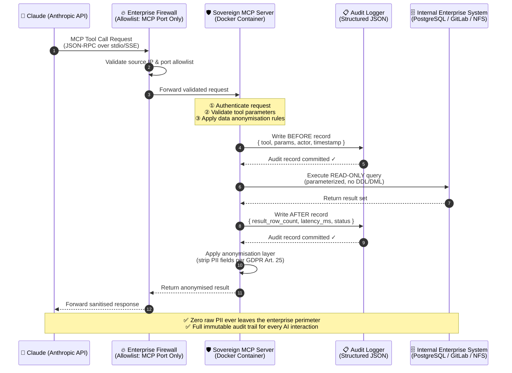

# 🛡️ Sovereign MCP Blueprints

**Production-ready Model Context Protocol server templates for regulated European enterprises.**  
Built for Public Sector, Healthcare, and Finance — where GDPR compliance, data locality, and auditability are non-negotiable.

[](./LICENSE)
[](https://spec.modelcontextprotocol.io)
[](https://www.docker.com/)
[](./docs/gdpr-compliance.md)
[](./docs/audit-logging.md)

---

## The Sovereign MCP Philosophy

> *"You shouldn't have to choose between AI capabilities and regulatory compliance."*

Most MCP server examples route your enterprise data through external clouds, creating unacceptable risks for regulated industries. **Sovereign MCP Blueprints** flips this model entirely.

Every blueprint in this repository is built on four unbreakable pillars:

| Pillar | Principle | Implementation |
|---|---|---|
| 🔒 **Zero-Trust** | No implicit trust, even inside your network | mTLS, allowlists, parameterized queries only |
| 📋 **Audit Logging** | Every AI action is a compliance record | Structured JSON logs with tool name, parameters, actor, timestamp |
| 🇪🇺 **GDPR by Design** | Data minimisation and purpose limitation baked in | Read-only tools, anonymisation layers, no data egress |
| 🏠 **Data Locality** | Your data never leaves your perimeter | 100% Docker-native, air-gap capable, no external calls |

---

## Architecture: Secure MCP Data Flow

The following diagram illustrates the security boundary enforced by every blueprint in this repository. Claude (running via the Anthropic API) **never** has direct access to your internal systems. All requests are mediated by the Sovereign MCP Server, which enforces policy, anonymises data, and writes an immutable audit record before any query is executed.



---

## Available Blueprints

| Blueprint | Status | Description | Target System |
|---|---|---|---|
| [`auditable-sql-mcp`](./blueprints/auditable-sql-mcp/) | ✅ **Ready** | Read-only SQL access with GDPR anonymisation and full audit logging | PostgreSQL, MySQL |
| [`local-gitlab-mcp`](./blueprints/local-gitlab-mcp/) | 🚧 *Coming Soon* | Self-hosted GitLab integration — issues, MRs, pipelines, no SaaS required | GitLab CE/EE |
| [`secure-files-mcp`](./blueprints/secure-files-mcp/) | 🚧 *Coming Soon* | Allowlisted filesystem access to NFS/SMB shares with path traversal protection | NFS, SMB, S3-compatible |

---

## Quick Start (Docker Only)

All blueprints run exclusively in Docker. No local Python or Node.js installation is ever required.

```bash
# 1. Clone the repository
git clone https://github.com/your-org/Sovereign-MCP-Blueprints.git
cd Sovereign-MCP-Blueprints

# 2. Navigate to a blueprint
cd blueprints/auditable-sql-mcp

# 3. Copy and configure the environment file
cp .env.example .env
# Edit .env with your database credentials and audit log path

# 4. Launch the entire stack
docker compose up -d

# 5. Verify the MCP server is healthy
docker compose logs mcp-server
```

---

## Security Model

### What Claude CAN do (via these blueprints)
- ✅ Execute parameterized, read-only SELECT queries
- ✅ Receive anonymised/pseudonymised result sets
- ✅ List available schemas (non-sensitive metadata only)

### What Claude CANNOT do
- ❌ Execute INSERT, UPDATE, DELETE, DROP, or any DDL/DML
- ❌ Access raw PII fields (names, emails, SSNs) — anonymisation layer strips these
- ❌ Reach any system not explicitly allowlisted in the MCP server config
- ❌ Bypass the audit log — every call is recorded before execution

### Audit Log Format
Every tool invocation produces a structured JSON record compatible with SIEM systems (Splunk, Elastic):

```json
{
  "event_type": "MCP_TOOL_CALL",
  "timestamp": "2025-01-15T09:23:41.123456Z",
  "session_id": "sess_a1b2c3d4",
  "tool_name": "query_anonymized_customer_data",
  "parameters": { "region": "DE", "limit": 10 },
  "actor": "claude-opus-4-5",
  "compliance_tags": ["GDPR_ART_25", "READ_ONLY", "ANONYMISED"],
  "status": "SUCCESS",
  "result_row_count": 10,
  "latency_ms": 42
}
```

---

## Repository Structure

```
Sovereign-MCP-Blueprints/
├── README.md                          # ← You are here
├── LICENSE                            # MIT License
├── docs/
│   ├── gdpr-compliance.md             # GDPR Article mapping
│   ├── audit-logging.md               # SIEM integration guide
│   └── threat-model.md               # Threat model & mitigations
├── blueprints/
│   ├── auditable-sql-mcp/             # ✅ Production-ready
│   │   ├── docker-compose.yml         # Full stack: MCP server + PostgreSQL
│   │   ├── Dockerfile                 # Hardened Python container
│   │   ├── .env.example               # Environment variable template
│   │   ├── requirements.txt           # Python dependencies
│   │   └── src/
│   │       └── server.py              # MCP server with audit logger
│   ├── local-gitlab-mcp/              # 🚧 Coming soon
│   │   └── README.md
│   └── secure-files-mcp/             # 🚧 Coming soon
│       └── README.md
└── .github/
    ├── ISSUE_TEMPLATE/
    │   ├── blueprint-request.md
    │   └── security-report.md
    └── CONTRIBUTING.md
```

---

## Contributing

We welcome contributions from the enterprise security community. Before submitting a blueprint, please review the [Security Checklist](./docs/security-checklist.md):

- [ ] Blueprint runs exclusively in Docker (no host dependencies)
- [ ] All tools are read-only by default (write tools require explicit opt-in flag)
- [ ] Audit logger is non-bypassable (wraps the tool handler, not inside it)
- [ ] `.env.example` contains no real credentials
- [ ] `docker-compose.yml` includes health checks on all services
- [ ] README includes a threat model section

---

## License & Legal

This project is licensed under the **MIT License**. See [LICENSE](./LICENSE) for details.

> **Important:** These blueprints provide a security architecture pattern. They are not a substitute for a formal security assessment by a qualified professional. Always conduct a Data Protection Impact Assessment (DPIA) under GDPR Article 35 before deploying AI tooling in regulated environments.

---

<p align="center">
  Built with ❤️ for European enterprise engineers who refuse to compromise on compliance.
</p>
